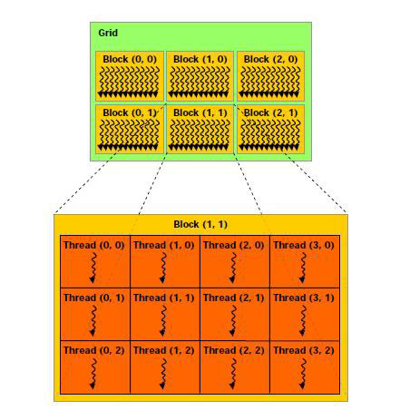

# CUDA Programming 
I want to learn CUDA programming; increasing my capability in AI and C++. Feel free to give recommendation 

## Grid and Block 
 <br>
*Image Source: [Implementation of Image Enhancement Algorithms and Recursive Ray Tracing using CUDA](https://www.researchgate.net/publication/300080119_Implementation_of_Image_Enhancement_Algorithms_and_Recursive_Ray_Tracing_using_CUDA?_tp=eyJjb250ZXh0Ijp7ImZpcnN0UGFnZSI6Il9kaXJlY3QiLCJwYWdlIjoiX2RpcmVjdCJ9fQ)*

```cppp
dim3 block(4, 3, 1)
dim3 grid(3 ,2 ,1)
```
- `dim3 block(4, 3, 1);` defines the block dimensions, which represents how many threads are in each block. The block is organized in a 3D space with 4 threads along the x-axis, 
3 threads along the y-axis, 1 thread along the z-axis. So, in total, each block contains 4 * 3 * 1 = 12 threads.
- `dim3 grid(3, 2, 1);` defines the grid dimensions, which represents how many blocks are in the grid. The grid is organized in a 3D space, with: 3 blocks along the x-axis, 2 blocks along the y-axis,
  1 block along the z-axis. So, in total, the grid contains 3 * 2 * 1 = 6 blocks.

So, the total number of threads launched in this kernel is 12 threads/block * 6 blocks = 72 threads.


